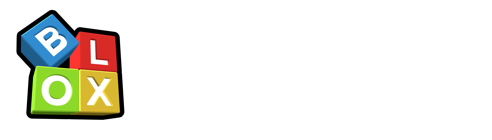

 

## BLOX City Documentation
- [Friendships](/documentation/friendships.md)

## About Laravel

Laravel is a web application framework with expressive, elegant syntax. We believe development must be an enjoyable and creative experience to be truly fulfilling. Laravel takes the pain out of development by easing common tasks used in many web projects, such as:

- [Simple, fast routing engine](https://laravel.com/docs/routing).
- [Powerful dependency injection container](https://laravel.com/docs/container).
- Multiple back-ends for [session](https://laravel.com/docs/session) and [cache](https://laravel.com/docs/cache) storage.
- Expressive, intuitive [database ORM](https://laravel.com/docs/eloquent).
- Database agnostic [schema migrations](https://laravel.com/docs/migrations).
- [Robust background job processing](https://laravel.com/docs/queues).
- [Real-time event broadcasting](https://laravel.com/docs/broadcasting).

Laravel is accessible, powerful, and provides tools required for large, robust applications.

## Learning Laravel

Laravel has the most extensive and thorough [documentation](https://laravel.com/docs) and video tutorial library of all modern web application frameworks, making it a breeze to get started with the framework.

If you don't feel like reading, [Laracasts](https://laracasts.com) can help. Laracasts contains over 2000 video tutorials on a range of topics including Laravel, modern PHP, unit testing, and JavaScript. Boost your skills by digging into our comprehensive video library.

## Additional Packages
- [Laravel Model Caching](https://github.com/GeneaLabs/laravel-model-caching/blob/master/README.md)

## BLOX City Team

These are the members of the team making this project possible on the web-side of things.

### Web Team

- **[Kyle](https://github.com/kavickers)** - Lead Developer, Backend
- **[Brixster](https://github.com/BrixsterPlanet)** - Contributor
- **[Daniil](https://github.com/daniiltrpv)** - Frontend
- **[Lausterman](https://github.com/Lausterman)** - Frontend
- **[studzy](https://github.com/warlord-hash)** - Backend

## Code of Conduct
- Participants will be tolerant of opposing views.
- Participants must ensure that their language and actions are free of personal attacks and disparaging personal remarks.
- When interpreting the words and actions of others, participants should always assume good intentions.
- Behavior that can be reasonably considered harassment will not be tolerated.

## Security Vulnerabilities
If you discover a security vulnerability within Laravel, please send an e-mail to Taylor Otwell via [taylor@laravel.com](mailto:taylor@laravel.com). 

If you discover a security vulnerability within the code itself, please send a message to **Kyle#8855** or **studzy#6889** immediately.

All security vulnerabilities will be promptly addressed.

## License

The Laravel framework is open-sourced software licensed under the [MIT license](https://opensource.org/licenses/MIT).

Any and all additions are copyrighted and strictly forbidden from being shared by BLOXCity.com.
